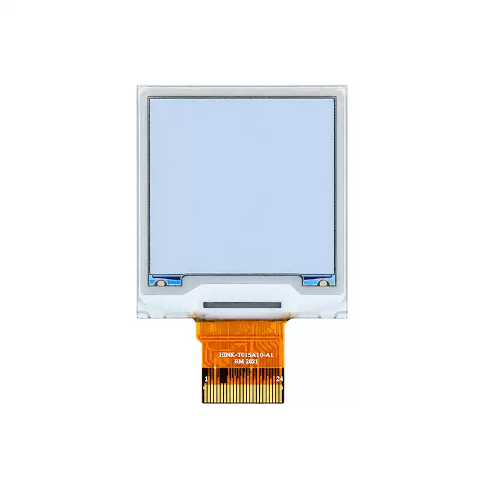

<p align="left"></p>

<h1 align="center">OSPTEK 1.54″ EPD 240×240（IST7513 · SPI）</h1>

<p align="center"><b>六色电子纸 · SPI · IST7513</b></p>

<p align="center"><a href="./README_EN.md">English</a> | 简体中文 · <a href="../../README.md">规格族索引</a></p>

<p align="center">
  
  
  
  
</p>

<p align="center"></p>

## 目录

- [产品简介](#产品简介)
- [规格参数](#规格参数)
- [仓库结构](#仓库结构)
- [相关资料](#相关资料)
- [购买链接](#购买链接)
- [技术支持](#技术支持)

---

## 产品简介

OSPTEK **1.54 寸 240×240 EPD** 是一款 **SPI** 接口六色电子纸模组，驱动为 **IST7513**。适用于防丢标签、手机配件与低功耗物联网显示。

规格标识（仓库名）：`epd-1.54-240x240-spi-ist7513`

当前模组版本：**EPD0154A10A3**。电气与外形细节以 [`docs/EPD0154A10A3.pdf`](./docs/EPD0154A10A3.pdf) 为准。

## 规格参数

| 项目 | 规格 |
| ---- | ---- |
| 尺寸 | 1.54 英寸 |
| 类型 | 六色电子纸（黑 / 白 / 红 / 黄 / 蓝 / 绿） |
| 分辨率 | 240×240 |
| 接口 | SPI |
| 驱动 IC | IST7513 |

> 完整外形尺寸、FPC 定义、供电与时序以产品规格书 / 驱动手册为准。

## 仓库结构

```text
epd-1.54-240x240-spi-ist7513/             # 仓库根（导航见 ../../README.md）
└── versions/
    └── EPD0154A10A3/                     # 本料号完整资料
        ├── README.md
        ├── README_EN.md
        ├── images/
        ├── docs/
        └── examples/
```

## 相关资料

### 本产品资料

| 资料 | 链接 |
| ---- | ---- |
| 产品规格书（EPD0154A10A3） | [`docs/EPD0154A10A3.pdf`](./docs/EPD0154A10A3.pdf) |
| 外形 CAD（EPD0154A10A3） | [`docs/EPD0154A10A3.dwg`](./docs/EPD0154A10A3.dwg) |
| 1.54 寸六色墨水屏底板原理图（V0.1） | [`docs/1.54寸6色墨水屏底板原理图V0.1.pdf`](./docs/1.54%E5%AF%B86%E8%89%B2%E5%A2%A8%E6%B0%B4%E5%B1%8F%E5%BA%95%E6%9D%BF%E5%8E%9F%E7%90%86%E5%9B%BEV0.1.pdf) |

## 购买链接

<p align="center">
  <a href="https://shop110742373.taobao.com/"></a>
  &nbsp;&nbsp;
  <a href="https://www.aliexpress.com/store/1105701619"></a>
</p>

**国内（淘宝）**

- 店铺：[鱼鹰光电工厂店](https://shop110742373.taobao.com/)

**海外（AliExpress）**

- 店铺：[OSPTEK Official Store](https://www.aliexpress.com/store/1105701619)

## 技术支持

- 技术支持 / 产品咨询：<luyu@osptek.com>
- QQ 技术交流群：**985881096**
- 公司官网：<https://osptek.com/>
- 有任何问题，都可以在本仓库 Issues 中提问

---

<p align="center"><sub>© 2026 OSPTEK 鱼鹰光电 · 本仓库资料采用 CC BY 4.0 许可</sub></p>
